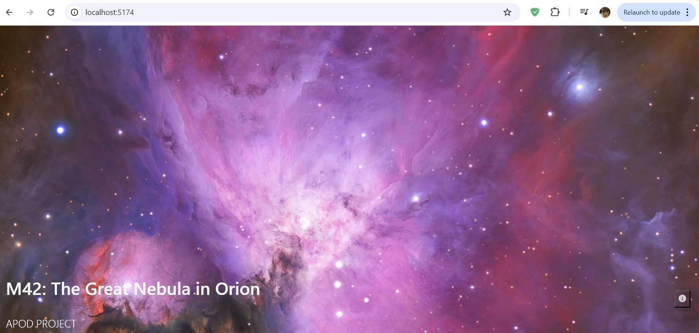
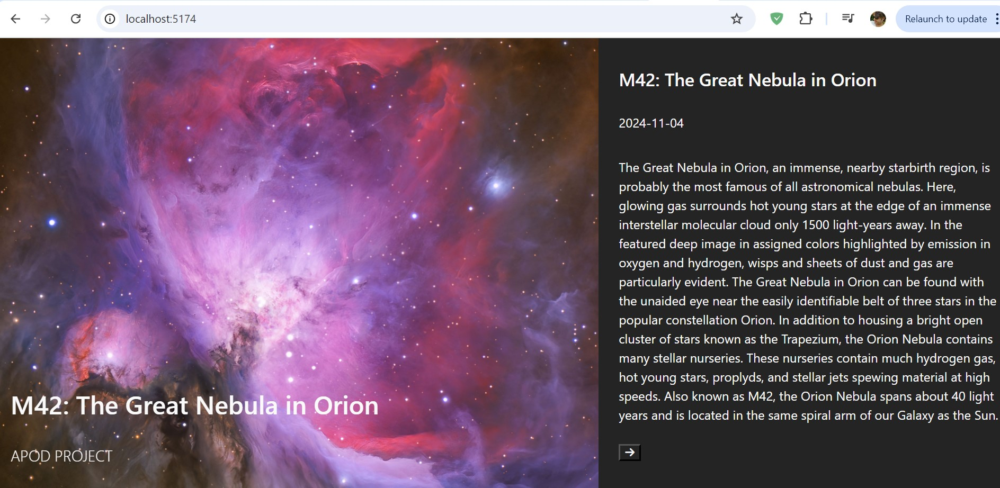

# NASA APOD Viewer
This application fetches and displays NASA's Astronomy Picture of the Day (APOD) along with the image title, date, and description. Users can view a high-definition image of the day and see detailed information in a sidebar. This project utilizes React and the NASA APOD API.

- <p></p>
- <p></p>
## Features
- APOD Fetching: Retrieves the Astronomy Picture of the Day from the NASA API.
- Caching: Caches the daily image to prevent redundant API calls within the same day.
- Dynamic Display: Shows the picture of the day with a title and description.
- Sidebar with Details: The sidebar displays additional details about the image, which can be toggled.
- Loading Animation: Displays a loading animation while fetching data.

# Setup
## Prerequisites
- Node.js and npm installed.
- A valid NASA APOD API key. You can obtain one [here](https://api.nasa.gov/).

## Usage
Upon loading, the app will:

1. Fetch the Astronomy Picture of the Day from the NASA API (or load from cache if already fetched today).
2. Display the image along with a title and date in the footer.
3. Allow users to view additional details (like a description) by toggling the sidebar.
## Caching
The app caches the image data in localStorage for a day to minimize API calls. If the app is opened multiple times on the same day, it will fetch the data from the cache.

# Components
## App.jsx
- Functionality: Fetches data from NASA's APOD API, caches it, and passes the data to other components.
- State:
   - data: Stores the fetched APOD data.
   - showModal: Controls the visibility of the sidebar.
   - loading: Shows a loading spinner while data is being fetched.
## Main.jsx
- Description: Displays the HD image of the day.
- Props: Receives data (APOD data) from App.jsx.
## SideBar.jsx
- Description: Displays additional details about the APOD image, including the title, date, and description. Users can close the sidebar by clicking outside of it or using a button.
- Props:
  - data: APOD data, passed from App.jsx.
  - handleToggleModal: Function to close the sidebar.
## Footer.jsx
- Description: Displays the title and a button to open the sidebar.
- Props:
  - data: APOD data, passed from App.jsx.
  - handleToggleModal: Function to toggle the sidebar.
# APOD API
This application uses NASA's Astronomy Picture of the Day (APOD) API. The API provides information and images of space phenomena, updated daily.

- Endpoint: https://api.nasa.gov/planetary/apod
- API Key: A valid API key is required and should be stored in an environment variable as VITE_NASA_API_KEY.
Example API Response:
```json
{
  "date": "2023-10-21",
  "explanation": "The famous Horsehead Nebula in Orion is not alone.",
  "hdurl": "https://apod.nasa.gov/apod/image/2310/Horsehead_Hubble_1600.jpg",
  "title": "The Horsehead Nebula in Orion"
}
```
# Technologies Used
  - React: For building the UI components.
  - JavaScript (ES6): Language used for component logic.
  - NASA APOD API: Provides image data.
  - Font Awesome: For icons.
  - CSS: Custom styles for component layout and design.
# License
This project is licensed under the MIT License.
